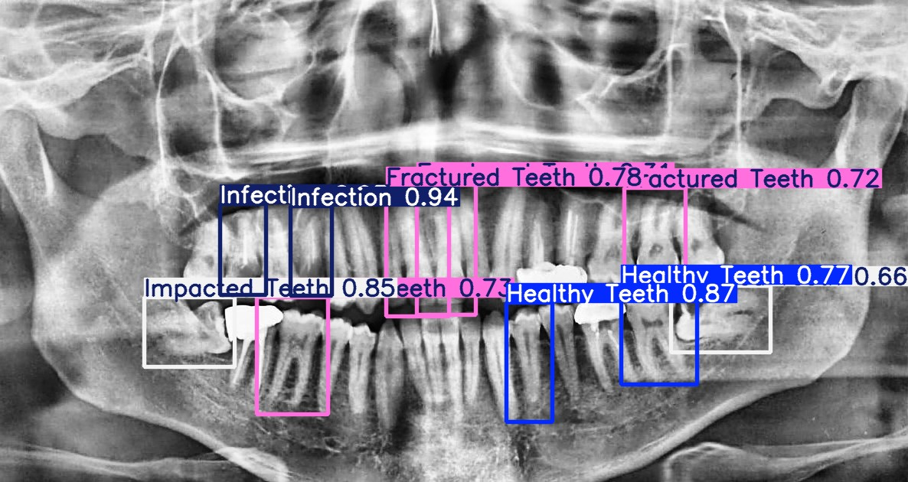

# Teeth Condition Detection with YOLO

A simple Python script that uses a YOLO model to detect teeth conditions in user-selected images. Users can select any image from their computer, and the script will display the detection results along with accuracy scores.

## Features

- Upload an image through a file dialog.
- Detect teeth conditions using a pre-trained YOLO model.
- Display annotated image with bounding boxes.
- Show average confidence/accuracy of detections.

## Requirements

- Python 3.8+
- [Ultralytics YOLO](https://pypi.org/project/ultralytics/) (`pip install ultralytics`)
- Tkinter (usually included with Python)
- Your trained YOLO weights file (`best.pt`) in the same folder as the script.

## Usage

1. Place your `best.pt` model file in the project folder.
2. Run the script:
3. Select an image file (.jpg, .jpeg, .png) when prompted.
4. The script will show:

  - Detection results in the console (average accuracy)

  - Annotated image with bounding boxes

##Example Output

##Notes

Ensure the model file best.pt is in the same folder as the script.

Supported image formats: JPG, JPEG, PNG.

This script is designed for easy testing and demonstration purposes.

Author

zaharo – 2026-02-18
